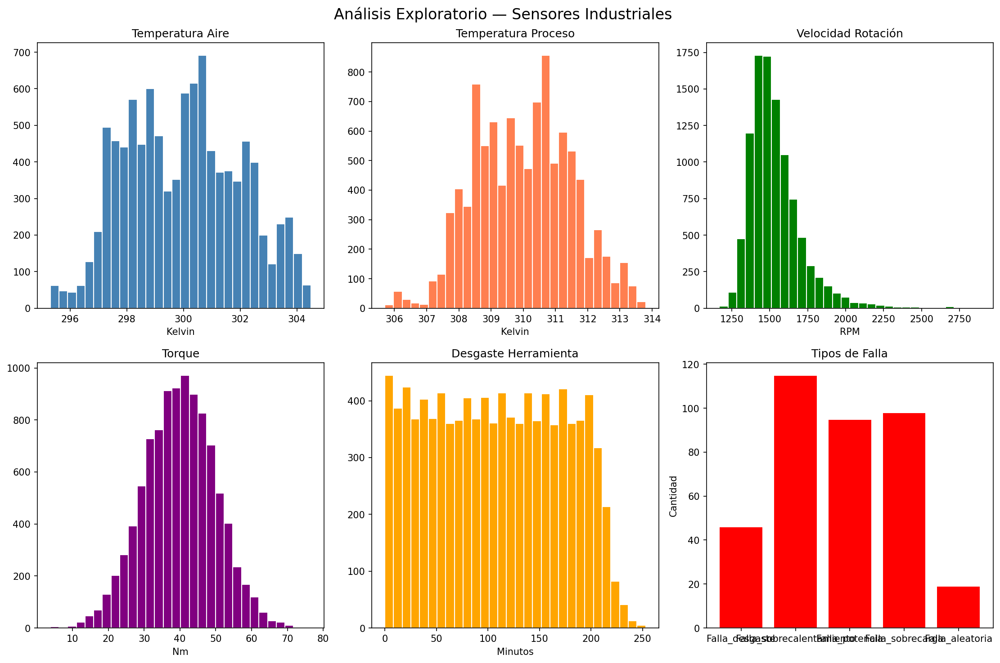
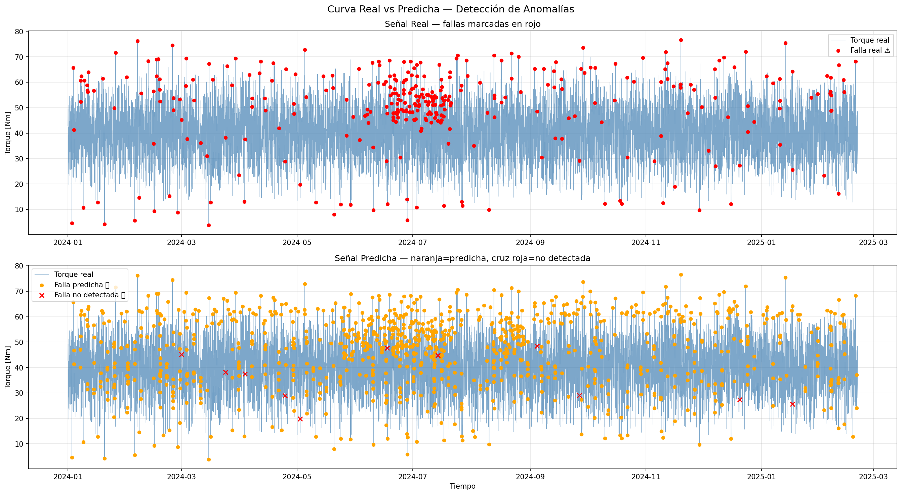

# Detección de Anomalías en Equipos Industriales con Machine Learning

## Descripción
Pipeline completo de Machine Learning para detectar fallas en equipos 
industriales antes de que ocurran, comparando la curva real de los sensores 
contra la curva predicha por el modelo.

## Problema que resuelve
En la industria, una falla no detectada a tiempo significa:
- Parada no planificada de producción
- Daño en equipos costosos
- Riesgo para el personal

Este modelo detecta el **97% de las fallas reales** antes de que ocurran,
analizando 5 sensores en tiempo real.

## Tecnologías utilizadas
- Python 3
- Google Colab
- Pandas y NumPy — limpieza y procesamiento de datos
- Scikit-learn — modelo de árbol de decisión
- Matplotlib y Seaborn — visualización

## Pipeline del proyecto
```
Captura de datos → Limpieza → Análisis descriptivo 
→ Balanceo de clases → Modelo ML → Detección de anomalías
```

## Resultados del modelo
| Métrica | Valor |
|---|---|
| Precisión general | 95% |
| Detección de fallas reales | 97% |
| Dataset | 10.000 registros industriales |

## Gráficos del análisis

### Análisis exploratorio de sensores


### Curva real vs curva predicha


## Cómo usar este proyecto
1. Abre el notebook en Google Colab
2. Sube tu archivo CSV con datos de sensores
3. Ejecuta las celdas en orden
4. El modelo entrega predicciones y gráficos automáticamente

## Servicios disponibles
¿Tienes datos de equipos industriales y quieres detectar fallas antes 
de que ocurran? Puedo implementar este mismo sistema con tus datos.

**Contacto:** [di.valdes.m@gmail.com]

## Autor
Ingeniero Eléctrico especializado en Machine Learning aplicado 
a la industria energética — Chile# predictive-maintenance-ml
Detección de anomalías en equipos industriales con Machine Learning
